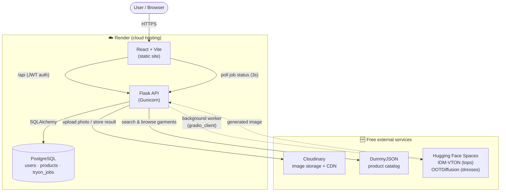
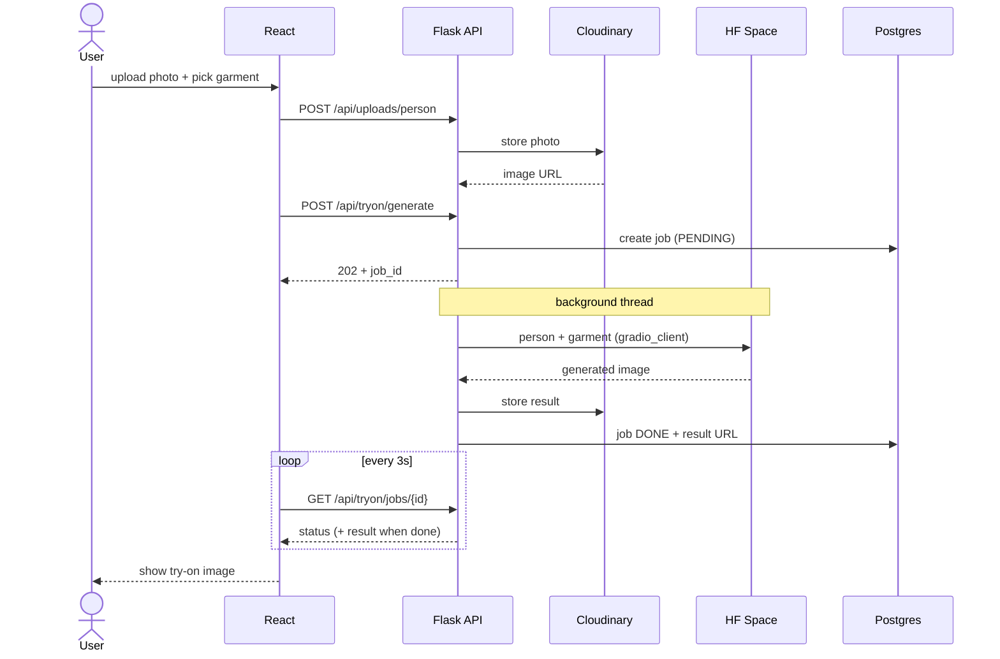

# FitVision — Demo Deliverables

## Architecture Diagram

> Renders automatically on GitHub. To export an image: paste into
> https://mermaid.live and download as PNG/SVG for slides.

## Try-On Sequence (how one try-on works)

## 30-Second Elevator Pitch

> FitVision is an AI virtual fitting room. You upload one photo of yourself,
> pick a piece of clothing from a live catalog, and the app generates a
> photorealistic image of you actually wearing it — in seconds. It's full-stack:
> a React frontend, a Flask API with secure user accounts, cloud image storage,
> and open-source AI try-on models, all running on a zero-cost cloud stack.
> The goal is simple — let people see how something looks on *them* before they buy.

*(~75 words ≈ 30 seconds at a natural pace.)*

## Tech Stack (one-liner for slides)

React + Vite · Flask + SQLAlchemy + JWT · PostgreSQL · Cloudinary · DummyJSON ·
Hugging Face (IDM-VTON / OOTDiffusion) · deployed on Render — **100% free tier.**
